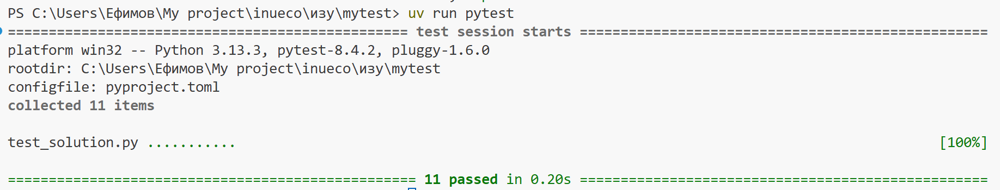

# Условие задачи: Анализ температуры

Напишите программу для анализа температурных данных за неделю.

## Требования:

1. Создайте функцию `analyze_temperature(temperatures)`, которая принимает список температур (целые числа) за 7 дней.

2. Функция должна вернуть словарь со следующими ключами:
   - `"average"` - средняя температура (округленная до 1 знака после запятой)
   - `"max"` - максимальная температура
   - `"min"` - минимальная температура
   - `"hot_days"` - количество дней, когда температура была выше 25 градусов
   - `"cold_days"` - количество дней, когда температура была ниже 10 градусов

3. Если список пустой, функция должна вернуть `None`.

4. Если в списке не 7 элементов, функция должна вернуть `None`.

## Примеры:

```python
temperatures = [22, 28, 15, 8, 30, 18, 25]
result = analyze_temperature(temperatures)
print(result)
# Ожидаемый результат:
# {
#     "average": 20.9,
#     "max": 30,
#     "min": 8,
#     "hot_days": 2,
#     "cold_days": 1
# }
```

```python
temperatures = [15, 16, 17]
result = analyze_temperature(temperatures)
print(result)
# Ожидаемый результат: None
```


