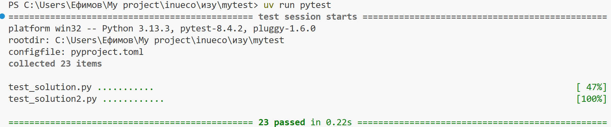

# Задание: Анализатор покупок в магазине

## Описание
Напишите программу для анализа списка покупок покупателя в магазине.

## Требования

Создайте функцию `analyze_purchases(items, prices, discount_threshold=1000)`, которая принимает:
- `items` - список названий товаров (строки)
- `prices` - список цен товаров (числа)
- `discount_threshold` - порог для скидки (по умолчанию 1000)

Функция должна вернуть словарь со следующими ключами:
- `"total"` - общая сумма покупок
- `"average"` - средняя цена товара (округленная до 2 знаков)
- `"most_expensive"` - название самого дорогого товара
- `"discount_applied"` - True, если применена скидка 10% (при сумме >= порога), иначе False
- `"final_total"` - итоговая сумма с учетом скидки (округленная до 2 знаков)

## Дополнительные требования
1. Если списки `items` и `prices` разной длины, вернуть `None`
2. Если списки пустые, вернуть `None`
3. Если есть отрицательные цены, вернуть `None`

## Примеры

```python
items = ["Хлеб", "Молоко", "Яйца", "Сыр"]
prices = [50, 80, 120, 350]

result = analyze_purchases(items, prices)
# result = {
#     "total": 600,
#     "average": 150.0,
#     "most_expensive": "Сыр",
#     "discount_applied": False,
#     "final_total": 600.0
# }
```

```python
items = ["Ноутбук", "Мышка", "Клавиатура"]
prices = [50000, 1500, 3500]

result = analyze_purchases(items, prices, 10000)
# result = {
#     "total": 55000,
#     "average": 18333.33,
#     "most_expensive": "Ноутбук",
#     "discount_applied": True,
#     "final_total": 49500.0
# }
```


