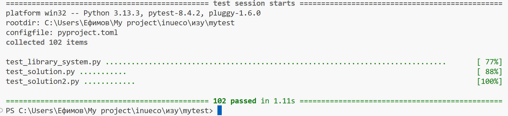

# Задание: Написание pytest тестов для системы управления библиотекой

## Описание задачи

Вам предоставлен код системы управления библиотекой, который включает три основных класса: `Book`, `Reader` и `Library`. Необходимо написать полный набор модульных и интеграционных тестов с использованием фреймворка **pytest**.


## Структура системы

### Классы для тестирования:

1. **`Book`** - представляет книгу в библиотеке
   - Атрибуты: `isbn`, `title`, `author`, `year`, `total_copies`, `available_copies`
   - Методы: `is_available()`, `borrow()`, `return_book()`

2. **`Reader`** - представляет читателя библиотеки
   - Атрибуты: `reader_id`, `name`, `email`, `borrowed_books`, `history`
   - Константа: `MAX_BOOKS = 5`
   - Методы: `can_borrow()`, `add_borrowed_book()`, `remove_borrowed_book()`

3. **`Library`** - основной класс управления библиотекой
   - Атрибуты: `name`, `books`, `readers`, `active_loans`
   - Константы: `LOAN_PERIOD_DAYS = 14`, `FINE_PER_DAY = 10.0`
   - Методы: `add_book()`, `register_reader()`, `borrow_book()`, `return_book()`, `calculate_fine()`, и др.

### Исключения:
- `BookNotAvailableError` - книга недоступна для выдачи
- `ReaderNotFoundError` - читатель не найден в системе


## Требования к тестам

### 1. Тестирование класса `Book` (минимум 8 тестов)

**Обязательные тесты:**
- ✅ Корректное создание объекта книги с валидными данными
- ✅ Валидация: пустой ISBN должен вызывать `ValueError`
- ✅ Валидация: пустое название должно вызывать `ValueError`
- ✅ Валидация: пустой автор должен вызывать `ValueError`
- ✅ Валидация: некорректный год (< 1000 или > текущего) должен вызывать `ValueError`
- ✅ Валидация: отрицательное количество копий должно вызывать `ValueError`
- ✅ Метод `is_available()` возвращает `True` когда есть доступные копии
- ✅ Метод `borrow()` уменьшает `available_copies` и возвращает `True`
- ✅ Метод `borrow()` возвращает `False` когда нет доступных копий
- ✅ Метод `return_book()` увеличивает `available_copies` и возвращает `True`
- ✅ Метод `return_book()` возвращает `False` когда все копии уже возвращены

### 2. Тестирование класса `Reader` (минимум 10 тестов)

**Обязательные тесты:**
- ✅ Корректное создание читателя с валидными данными
- ✅ Валидация: пустой `reader_id` должен вызывать `ValueError`
- ✅ Валидация: пустое имя должно вызывать `ValueError`
- ✅ Валидация: пустой email должен вызывать `ValueError`
- ✅ Валидация: email без символа '@' должен вызывать `ValueError`
- ✅ Метод `can_borrow()` возвращает `True` когда у читателя меньше `MAX_BOOKS`
- ✅ Метод `can_borrow()` возвращает `False` когда достигнут лимит
- ✅ Метод `add_borrowed_book()` добавляет ISBN в `borrowed_books`
- ✅ Метод `add_borrowed_book()` возвращает `False` при попытке добавить дубликат
- ✅ Метод `add_borrowed_book()` возвращает `False` при превышении лимита
- ✅ Метод `remove_borrowed_book()` удаляет ISBN из `borrowed_books`
- ✅ Метод `remove_borrowed_book()` возвращает `False` если книги нет в списке
- ✅ История (`history`) корректно записывает операции с временными метками

### 3. Тестирование класса `Library` (минимум 15 тестов)

**Обязательные тесты:**

**Базовые операции:**
- ✅ Корректное создание библиотеки
- ✅ Валидация: пустое название библиотеки должно вызывать `ValueError`
- ✅ Метод `add_book()` добавляет новую книгу и возвращает `True`
- ✅ Метод `add_book()` увеличивает количество копий для существующей книги
- ✅ Метод `register_reader()` регистрирует нового читателя
- ✅ Метод `register_reader()` возвращает `False` для дубликата

**Поиск:**
- ✅ Метод `find_books_by_author()` находит книги (регистронезависимый поиск)
- ✅ Метод `find_books_by_title()` находит книги (регистронезависимый поиск)
- ✅ Метод `get_available_books()` возвращает только доступные книги

**Выдача книг (`borrow_book()`):**
- ✅ Успешная выдача книги читателю
- ✅ Выброс `ReaderNotFoundError` для несуществующего читателя
- ✅ Возврат `(False, message)` для несуществующей книги
- ✅ Выброс `BookNotAvailableError` когда книга недоступна
- ✅ Возврат `(False, message)` когда читатель достиг лимита книг
- ✅ Возврат `(False, message)` когда читатель уже взял эту книгу
- ✅ Проверка добавления записи в `active_loans` с корректной датой возврата

**Возврат книг (`return_book()`):**
- ✅ Успешный возврат книги без штрафа (в срок)
- ✅ Выброс `ReaderNotFoundError` для несуществующего читателя
- ✅ Возврат `(False, 0.0)` для несуществующей книги
- ✅ Возврат `(False, 0.0)` если эта книга не была взята читателем
- ✅ Расчет штрафа при просрочке возврата
- ✅ Удаление записи из `active_loans` после возврата

**Дополнительные методы:**
- ✅ Метод `calculate_fine()` возвращает 0 для непросроченного займа
- ✅ Метод `calculate_fine()` корректно рассчитывает штраф (дни * `FINE_PER_DAY`)
- ✅ Метод `get_overdue_loans()` возвращает список просроченных займов
- ✅ Метод `get_reader_stats()` возвращает корректную статистику
- ✅ Метод `get_reader_stats()` выбрасывает `ReaderNotFoundError` для несуществующего читателя
- ✅ Метод `get_popular_books()` возвращает топ популярных книг

### 4. Использование pytest fixtures (обязательно)

Необходимо создать следующие фикстуры:

```python
@pytest.fixture
def sample_book():
    """Фикстура для создания тестовой книги"""
    # ваш код

@pytest.fixture
def sample_reader():
    """Фикстура для создания тестового читателя"""
    # ваш код

@pytest.fixture
def library_with_data():
    """Фикстура для создания библиотеки с предзаполненными данными"""
    # ваш код

@pytest.fixture
def empty_library():
    """Фикстура для создания пустой библиотеки"""
    # ваш код
```

### 5. Параметризованные тесты (минимум 3 теста)

Используйте `@pytest.mark.parametrize` для проверки различных входных данных.

**Примеры:**
- Тестирование валидации года издания с разными некорректными значениями
- Тестирование различных некорректных email-адресов
- Тестирование поиска книг с разными запросами

**Пример:**
```python
@pytest.mark.parametrize("year", [999, 2030, -100, 0])
def test_book_invalid_year_should_raise_error(year):
    # ваш код
```

### 6. Тестирование исключений

Используйте `pytest.raises()` для проверки корректного выброса исключений:

```python
def test_should_raise_book_not_available_error():
    with pytest.raises(BookNotAvailableError):
        # код, который должен вызвать исключение
```

### 7. Работа с датами и временем

Используйте `monkeypatch` для подмены `datetime.now()` при тестировании:
- Штрафов за просрочку
- Просроченных займов
- Дат возврата

**Пример:**
```python
def test_calculate_fine_for_overdue(monkeypatch):
    # Подменяем текущее время
    class MockDatetime:
        @staticmethod
        def now():
            return datetime(2025, 1, 20)
    
    monkeypatch.setattr('your_module.datetime', MockDatetime)
    # ваш тест
```

### 8. Интеграционные тесты (минимум 2 теста)

Напишите тесты, проверяющие полный жизненный цикл операций:

**Тест 1: Полный цикл работы с книгой**
1. Создание библиотеки
2. Добавление книги
3. Регистрация читателя
4. Выдача книги
5. Проверка статистики
6. Возврат книги
7. Проверка обновленной статистики

**Тест 2: Сценарий с просрочкой**
1. Выдача книги
2. Эмуляция просрочки (через monkeypatch)
3. Проверка расчета штрафа
4. Возврат с штрафом

### 9. Дополнительные требования

- ✅ Используйте `pytest.approx()` для сравнения float значений (штрафы)
- ✅ Каждый тест должен быть независимым
- ✅ Используйте понятные названия тестов: `test_should_<expected_behavior>`
- ✅ Добавьте docstring к сложным тестам
- ✅ Общее количество тестов: **минимум 40**


## Структура файла с тестами

Создайте файл `test_library_system.py` со следующей структурой:

```python
"""
Тесты для системы управления библиотекой
"""
import pytest
from datetime import datetime, timedelta
from library_system import (
    Book, Reader, Library,
    BookNotAvailableError, ReaderNotFoundError
)


# ============= FIXTURES =============

@pytest.fixture
def sample_book():
    # ваш код
    pass


@pytest.fixture
def sample_reader():
    # ваш код
    pass


# ... другие фикстуры


# ============= ТЕСТЫ КЛАССА BOOK =============

class TestBook:
    def test_should_create_book_with_valid_data(self):
        # ваш код
        pass
    
    # ... остальные тесты


# ============= ТЕСТЫ КЛАССА READER =============

class TestReader:
    def test_should_create_reader_with_valid_data(self):
        # ваш код
        pass
    
    # ... остальные тесты


# ============= ТЕСТЫ КЛАССА LIBRARY =============

class TestLibrary:
    def test_should_create_library_with_valid_name(self):
        # ваш код
        pass
    
    # ... остальные тесты


# ============= ИНТЕГРАЦИОННЫЕ ТЕСТЫ =============

class TestIntegration:
    def test_full_book_lifecycle(self):
        # ваш код
        pass
    
    # ... остальные тесты
```

## Чек лист

| Критерий |
|----------|
| Все классы покрыты тестами (40+ тестов) |
| Использованы fixtures правильно |
| Есть параметризованные тесты (минимум 3) |
| Корректное тестирование исключений |
| Использование monkeypatch для работы с датами |
| Интеграционные тесты (минимум 2) |
| Независимость тестов друг от друга |
| Понятные названия тестов и код |
| Использование pytest.approx() где нужно |
| Покрытие кода минимум 85% |


## Полезные команды

**Запуск всех тестов:**
```bash
pytest test_library_system.py -v
```

**Запуск с покрытием кода:**
```bash
pytest test_library_system.py --cov=library_system --cov-report=html
```

**Запуск конкретного класса тестов:**
```bash
pytest test_library_system.py::TestBook -v
```

**Запуск конкретного теста:**
```bash
pytest test_library_system.py::TestBook::test_should_create_book_with_valid_data -v
```

## Подсказки

1. **Для тестирования datetime:** Используйте `monkeypatch.setattr()` или библиотеку `freezegun`
2. **Для проверки float:** `assert actual == pytest.approx(expected)`
3. **Для проверки списков:** можно использовать `assert set(actual) == set(expected)`
4. **Изоляция тестов:** каждая фикстура должна создавать новые объекты
5. **Проверка сообщений исключений:** 
   ```python
   with pytest.raises(ValueError, match="Некорректный email"):
       # код
   ```

## Соответствие ожиданиям

- Файл должен называться `test_library_system.py`
- Все тесты должны проходить успешно
- Минимальное покрытие кода: **85%**
- Минимальное количество тестов: **40**

