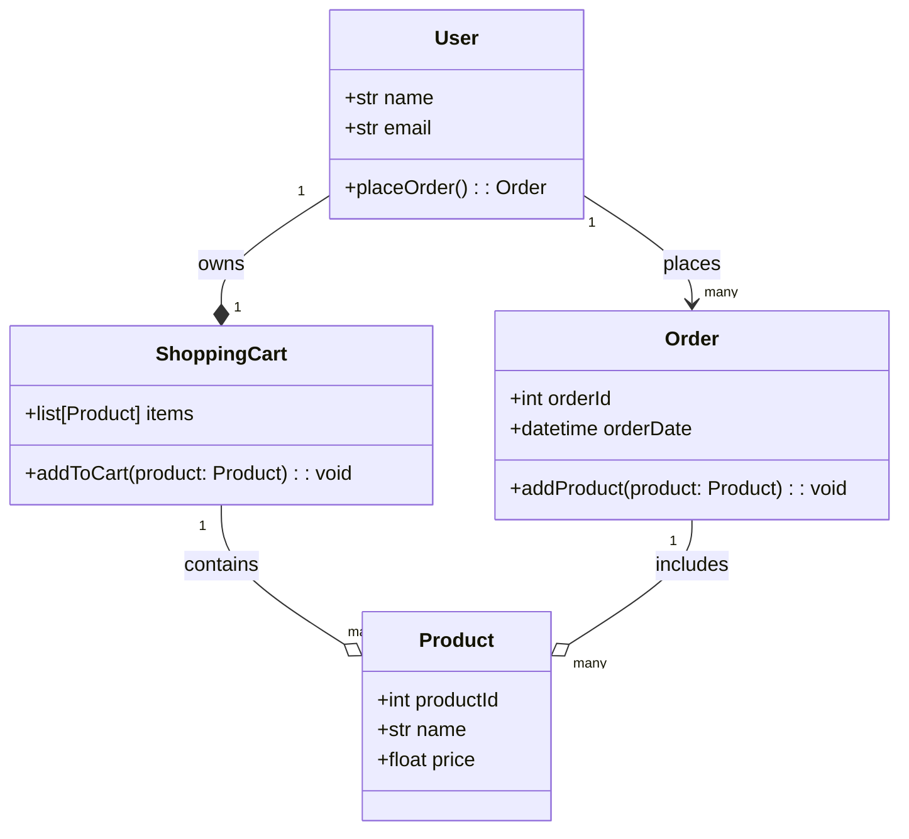

## uml class diagramm

```mermaid
classDiagram
    %% Основные классы
    class User {
        +str name
        +str email
        +placeOrder(): Order
    }
    class Order {
        +int orderId
        +datetime orderDate
        +addProduct(product: Product): void
    }
    class Product {
        +int productId
        +str name
        +float price
    }
    class ShoppingCart {
        +list[Product] items
        +addToCart(product: Product): void
    }

    %% Отношения между классами
    User "1" --> "many" Order : places
    User "1" --* "1" ShoppingCart : owns
    ShoppingCart "1" --o "many" Product : contains
    Order "1" --o "many" Product : includes
```